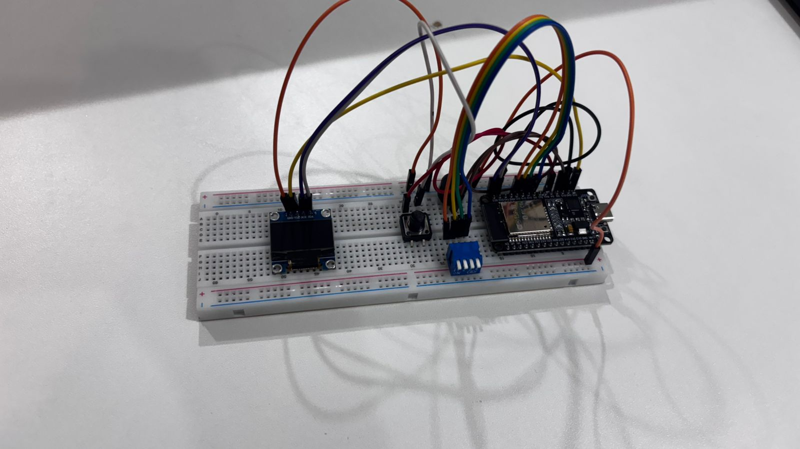
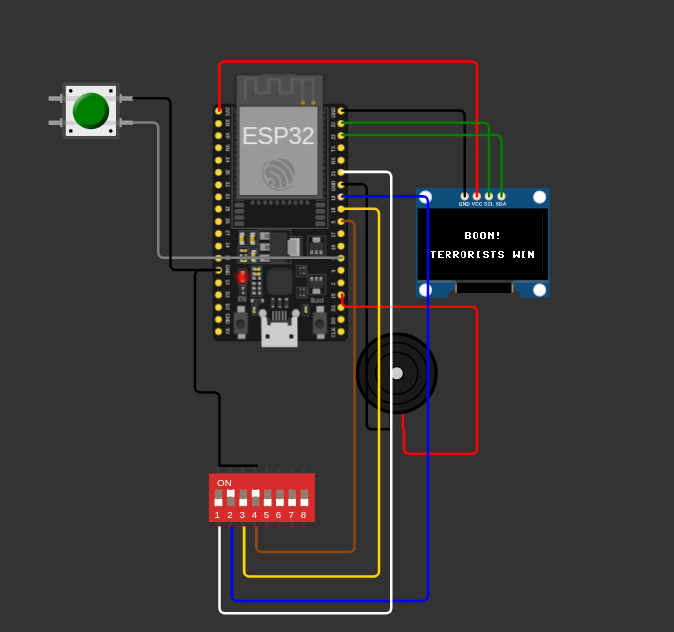

# 💣 C4 Multi-Desarme Minigame (ESP32 + MicroPython)

Este projeto é um minigame interativo inspirado na mecânica de desarme de bomba (C4) do clássico jogo _Counter-Strike_. O objetivo do jogador (Counter-Terrorist) é decodificar e inserir sequências numéricas binárias através de chaves seletoras e confirmar o código usando um botão **Enter** antes que o tempo de 40 segundos se esgote. O jogo possui 3 estágios randômicos e penalidades de tempo para erros.

---

## 💻 1. Software e Lógica de Funcionamento

O código foi desenvolvido em **MicroPython** utilizando o VS Code e roda diretamente no microcontrolador ESP32.

### Principais Recursos do Código:

- **Lógica Não-Bloqueante (`time.ticks_ms`):** O loop principal gerencia o tempo restante, a taxa de atualização do display e a frequência dos bips do buzzer de forma paralela. Isso impede que o som trave a contagem do relógio.
- **Sistema de Estágios Dinâmicos:** O jogador precisa passar por 3 fases consecutivas. A cada acerto, um novo número hexadecimal randômico (entre `1` e `F`) é gerado pelo display.
- **Mecânica de Penalidade:** Apertar o botão **Enter** com a combinação incorreta nos switches deduz imediatamente **5 segundos** do tempo restante total e emite um alarme grave.
- **Bip de Urgência Acústica:** A velocidade dos bips do buzzer acelera automaticamente conforme o tempo vai se esgotando (20s, 10s, 5s), aumentando a tensão da partida.

---

## 🔌 2. Circuito e Conexões (Pinagem ESP32)

O circuito foi projetado utilizando resistores de _pull-up_ internos do próprio ESP32 para simplificar o hardware físico e evitar o uso de resistores externos na bancada.

| Componente             | Pino ESP32    | Tipo de Sinal     | Descrição Física / Conexão                          |
| :--------------------- | :------------ | :---------------- | :-------------------------------------------------- |
| **Display OLED (SCL)** | `GPIO 23`     | Digital (I2C)     | Clock de comunicação do Display                     |
| **Display OLED (SDA)** | `GPIO 22`     | Digital (I2C)     | Dados de comunicação do Display                     |
| **Buzzer (Positivo)**  | `GPIO 15`     | Saída PWM         | Emissão de frequências sonoras (bips)               |
| **Switch 8 (Bit 3)**   | `GPIO 5`      | Entrada (Pull-Up) | Chave do bit mais significativo (Valor 8)           |
| **Switch 4 (Bit 2)**   | `GPIO 18`     | Entrada (Pull-Up) | Chave do segundo bit (Valor 4)                      |
| **Switch 2 (Bit 1)**   | `GPIO 19`     | Entrada (Pull-Up) | Chave do terceiro bit (Valor 2)                     |
| **Switch 1 (Bit 0)**   | `GPIO 21`     | Entrada (Pull-Up) | Chave do bit menos significativo (Valor 1)          |
| **Botão ENTER**        | `GPIO 4`      | Entrada (Pull-Up) | Botão pulsador de validação de código               |
| **Alimentação Geral**  | `3V3` e `GND` | Energia           | Linhas de alimentação do Display e barramento comum |

> ⚠️ _Nota de Montagem:_ Todas as chaves (Switches) e o botão Enter devem ser conectados entre o pino correspondente do ESP32 e o **GND**. Quando o botão é pressionado, o pino lê nível lógico baixo (`0`), o qual é invertido por software para processar o jogo.

---

## 🧮 3. Dimensionamento e Cálculos dos Componentes

Para a gravação do relatório em vídeo, o dimensionamento elétrico dos periféricos baseou-se nos seguintes critérios técnicos:

### A. Botões e Switches (Entradas Digitais)

Não foi necessário adicionar resistores de pull-up físicos na matriz de contatos. Configurou-se o registrador interno do ESP32 via software (`Pin.PULL_UP`), que ativa um resistor interno equivalente de aproximadamente **30 kΩ a 50 kΩ**.

- **Cálculo da corrente por pino:** $$I = \frac{V}{R} = \frac{3.3V}{33000\Omega} \approx 0.1 mA$$
  Este valor é extremamente seguro, minimizando o consumo energético e protegendo o canal do GPIO contra sobrecorrente.

### B. Módulo Display OLED SSD1306

O display opera nativamente em níveis de tensão de **3.3V**, compatível com a tolerância lógica máxima descrita no manual do ESP32. O consumo de corrente típico com a maioria dos pixels acesos gira em torno de **15 mA a 20 mA**, o que permite alimentá-lo diretamente pelo pino `3V3` do ESP32 (cujo regulador interno suporta picos de até 600 mA).

### C. Transmissor Acústico (Buzzer)

Utilizou-se um buzzer piezoelétrico conectado ao pino `GPIO 15` operando com modulação por largura de pulso (**PWM**). O ciclo de trabalho foi fixado em 50% (`32768` em 16-bits) para garantir máxima amplitude harmônica sem forçar o pino de saída, mantendo a corrente drenada abaixo do limite máximo recomendado de **20 mA** por pino do microcontrolador.

---

## 📸 4. Simulador

Acesse o simulador Wokwi pelo [LINK](https://wokwi.com/projects/468300848118673409)

---

## 📸 5. Imagens do Projeto

Aqui estão os registros do circuito montado na Protoboard e no Simulador Wokwi.

---

## 🎥 6. Demonstração e Explicação em Vídeo

▶️ **[ASSISTIR VÍDEO DE DEMONSTRAÇÃO (YOUTUBE)](https://youtu.be/QQp_lZkyC50)**

---

## Integrantes

- Henrique Alcici Sanchez
- João Matheus Frota Girão
- João Pedro Cremasco Luiz
- Thomas Riki Hashima
